a# 🚀 HIRECONNECT: TECHNICAL ARCHITECTURE & SYSTEMS ENGINEERING DOCUMENTATION

**HireConnect** is a state-of-the-art, enterprise-grade job portal engineered on a highly-performant, secure, and resilient **Microservices Architecture**. It facilitates a seamless, real-time ecosystem for **Candidates**, **Recruiters**, and **Platform Administrators** to manage careers, orchestrate professional placements, and oversee platform scaling metrics.

---

## 1. PROJECT OVERVIEW

### 📌 System Definition & Core Utility
HireConnect decouples typical job board activities—such as posting openings, indexing resumes, tracking applications, scheduling interviews, and billing subscriptions—into autonomous, single-responsibility microservices. By enforcing strict separation of concerns, the system ensures that high-volume operations (like job searching and application submission) scale independently of administrative or transactional flows.

### 🧩 Core Modules & Features
1. **Identity & Access Management**: Secure registration, OAuth2 integration (Google Login), session verification, and token refresh capabilities.
2. **Dynamic Profiles**: Form-driven profile builders, resume file hosting, and interactive avatar management.
3. **Job Lifecycle Engine**: Elastic search constraints, category filters, multi-parameter searching, and recruiter posting limits.
4. **Application Tracking System (ATS)**: State-driven pipelines (Applied → Shortlisted → Interviewing → Hired/Rejected) with historical change logging.
5. **Collaborative Scheduling**: Online interview management, Google Meet integrations, custom feedback, and automated sync.
6. **Real-time Alert Mesh**: Instant visual toaster alerts via WebSocket connections and parallel asynchronous background notifications.
7. **Monetized Subscriptions**: Tiered billing, payment order creation via Razorpay, payment validation, and automated PDF invoice generation.
8. **Aggregation & System Analytics**: On-the-fly cross-service statistics compiling, overall revenue metrics, conversion rates, and live service-mesh health indicators.

### 👥 Granular User Roles
*   **Candidate (Job Seeker)**:
    *   Creates a detailed resume profile featuring address embedding, list-based projects, achievements, and languages.
    *   Searches jobs using fuzzy parameters (title, location, salary).
    *   Bookmarks matching job profiles for later actions.
    *   Submits applications uploading resumes directly.
    *   Tracks application statuses in real-time.
    *   Confirms, schedules, and joins Google Meet interviews.
*   **Recruiter (Employer)**:
    *   Creates a business profile displaying company size, headquarters, websites, and logos.
    *   Accesses a tiered job posting budget (Free: 10, Monthly 99: 20, Monthly 199: 50 active posts).
    *   Posts rich job templates detailing experience levels, budgets, and required skills.
    *   Manages applicant pipelines through visual status movements.
    *   Schedules interviews triggering background notifications.
    *   Accesses analytics covering applicants' progress.
*   **Platform Administrator**:
    *   Monitors overall system health across Eureka registry and individual service endpoints.
    *   Moderates public listings, deleting problematic job postings.
    *   Manages users, including the deletion or temporary suspension of malicious accounts.
    *   Monitors billing records, downloading invoices and tracking platform growth rates.

---

## 2. SYSTEM ARCHITECTURE

HireConnect operates on a modern, decoupled client-server microservices pattern. 

### 🖥️ Frontend Flow
The user interacts with a responsive React (Vite-powered) single-page application.
1. All HTTP traffic is channeled through a centralized **Axios HTTP Client** configured with request and response interceptors.
2. **Request Interceptor**: Extracts the JWT access token from `localStorage` (`hc_access_token`) and appends it to the `Authorization: Bearer <token>` header.
3. **Response Interceptor**: Intercepts `401 Unauthorized` API errors. If a refresh token is present (`hc_refresh_token`), it issues a silent call to `/auth/refresh` to fetch a new access token, preventing user interruption. If invalid, it clears credentials and redirects to `/login`.
4. **WebSocket Connection**: Connects to the gateway's websocket handshaking endpoint (`ws-notifications`) using SockJS and STOMP to listen for targeted real-time alerts.

### ⚙️ Backend Microservices, Databases & Cache Layers
1. **Eureka Discovery Server**: Acts as the dynamic directory where all services register their metadata, health checks, and port allocations.
2. **API Gateway**: Standardizes entry routing. Bypasses security check for public endpoints, routes requests dynamically by querying Eureka, and passes identity headers downstream.
3. **Core Services**: 8 independent business services. Each service contains its own private MySQL database schema, avoiding distributed data coupling.
4. **Redis Cache**: Installed to cache high-read endpoints. In `auth-service`, it caches token validation statuses. In `job-service`, it caches hot public search queries.
5. **RabbitMQ Message Broker**: Manages asynchronous, non-blocking inter-service events (specifically interview events which decoupled from the notification engine).
6. **Swagger (OpenAPI 3)**: Automatically reads controller pathways on each service, rendering interactive API testing playgrounds.

---

### 🗺️ High-Level Architecture Diagram
```mermaid
graph TD
    Client[React Frontend - Port 80/5173] -->|API Requests| Gateway[API Gateway - Port 8080]
    Client -->|WebSocket /ws-notifications| Gateway
    
    Gateway -->|JWT Validate| Auth[Auth Service - Port 8081]
    
    subgraph Service Mesh (Dynamic Routing via Eureka Server - Port 8761)
        Gateway -->|Route| Profile[Profile Service - Port 8082]
        Gateway -->|Route| Job[Job Service - Port 8083]
        Gateway -->|Route| Application[Application Service - Port 8084]
        Gateway -->|Route| Interview[Interview Service - Port 8085]
        Gateway -->|Route| Notification[Notification Service - Port 8086]
        Gateway -->|Route| Subscription[Subscription Service - Port 8087]
        Gateway -->|Route| Analytics[Analytics Service - Port 8088]
    end

    subgraph Messaging & Cache
        Interview -->|Publish Event| Rabbit[RabbitMQ Broker - Port 5672]
        Rabbit -->|Consume Event| Notification
        Auth -->|Read/Write Session| Redis[(Redis Caching - Port 6379)]
        Job -->|Cache Jobs| Redis
    end
```

---

### 🗺️ Client-Server Architecture Diagram
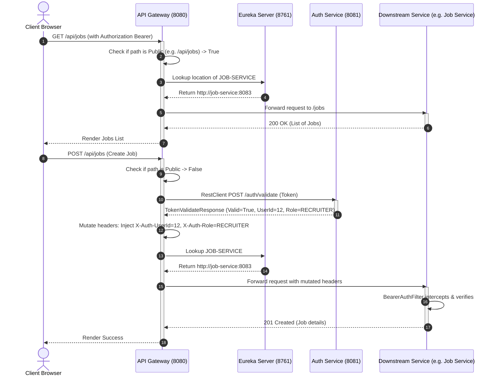

---

### 🗺️ Microservice Interaction Diagram
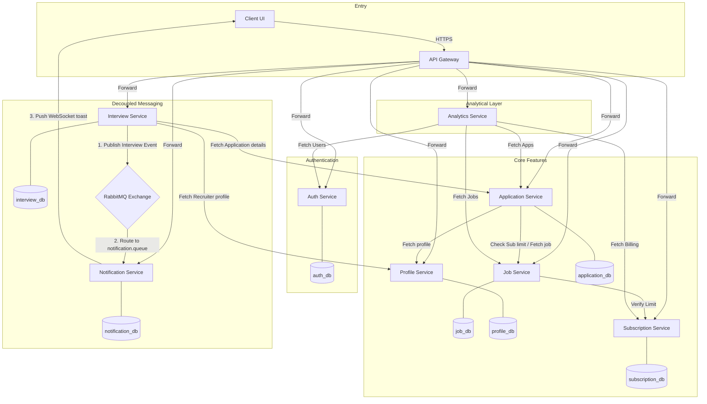

---

## 3. MICROSERVICES EXPLANATION

HireConnect consists of **10 distinct systems**. Below is the exhaustive structural, operational, and interaction profile for each system:

---

### 1. Eureka Server (Service Registry)
*   **Purpose**: Manages active instances of all backend nodes.
*   **Responsibilities**:
    *   Collects heartbeat signals from each service to mark status.
    *   Maintains a dynamic local routing map for service lookup.
    *   Enables client-side load balancing via dynamic routing parameters.
*   **APIs Handled**: Internal Netflix Eureka client polling endpoints (`/eureka/apps`).
*   **Database Tables**: In-memory concurrent maps (no persistent store).
*   **Downstream Communications**: Listens to registrations from all other microservices.
*   **Tech Stack**: Java 21, Spring Boot 4.0.5, Spring Cloud Netflix Eureka Server.
*   **Security Implementation**: Secured inside private network layers; endpoints isolated from public gateway routing.
*   **Internal Flow**: Registers service name, hostname, IP, port, and health check URLs on startup. Prunes instances failing 3 consecutive heartbeat cycles.

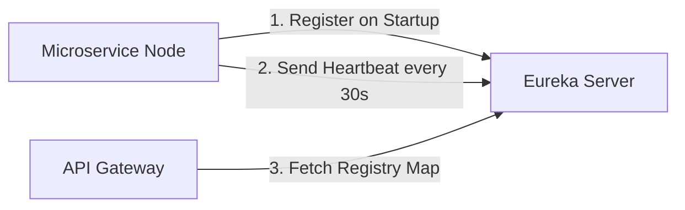

---

### 2. API Gateway
*   **Purpose**: Serves as the single-entry gateway proxying all HTTPS requests.
*   **Responsibilities**:
    *   Aggregates route rules to decouple frontend ports from internal backend ports.
    *   Implements a custom global `JwtAuthGlobalFilter` to perform stateless JWT checking.
    *   Mutates downstream headers to pass parsed identities safely.
    *   Coordinates CORS management policies allowing smooth client integrations.
*   **APIs Handled**: Proxies all routes matching `/api/**`. Exposes `/ws-notifications/**` path for WebSockets.
*   **Database Tables**: Stateless (no database).
*   **Downstream Communications**: Queries Eureka to load balance and proxy all microservice ports.
*   **Tech Stack**: Java 21, Spring Boot, Spring Cloud Gateway, Reactive WebFlux, WebClient.
*   **Security Implementation**:
    *   Bypasses validation for explicit public routes (`/api/auth/login`, `/api/auth/register`, `/v3/api-docs/**`, etc.).
    *   Exchanges incoming token with `/auth/validate` endpoint using dynamic Spring WebClient reactively.
    *   Injects authenticated user credentials into headers: `X-Auth-UserId`, `X-Auth-Email`, and `X-Auth-Role`.
*   **Internal Flow**:
    1. Intercepts incoming HTTP call.
    2. Runs match against the `PUBLIC_PATHS` list. If matched, triggers downstream call immediately.
    3. If private, extracts `Authorization` Bearer header.
    4. Issues reactive REST request to `auth-service` to validate the JWT.
    5. On success, mutates headers and routes request. On failure, responds with a structured `401 Unauthorized` JSON.

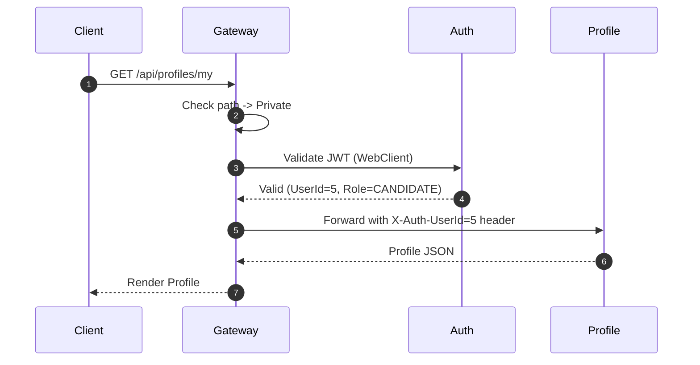

---

### 3. Auth Service
*   **Purpose**: Manages user identity, credentials validation, password hashing, and token issuance.
*   **Responsibilities**:
    *   Implements standard email/password registration and login pipelines.
    *   Performs Google OAuth2 Authorization Code flow redirects and handling.
    *   Generates highly secure stateless JWT Access and Refresh tokens.
    *   Maintains an admin console capable of suspending or deleting credentials.
*   **APIs Handled**: 
    *   `POST /auth/register` (Register user)
    *   `POST /auth/login` (Standard credentials verification)
    *   `POST /auth/validate` (Stateless token parsing for Gateway and other services)
    *   `POST /auth/refresh` (Refresh expired access tokens)
    *   `GET /auth/users` (Admin only list)
    *   `PUT /auth/users/{id}/suspend` (Admin suspension)
*   **Database Tables**: `users` (UserCredential Entity).
*   **Downstream Communications**: None. Resolves incoming identity requests from API Gateway.
*   **Tech Stack**: Java 21, Spring Boot, Spring Security 6, JWT (jjwt library), BCrypt, Spring Data JPA, MySQL 8.
*   **Security Implementation**:
    *   Standardizes session policy to `SessionCreationPolicy.IF_REQUIRED` to handle brief OAuth2 state cookies while maintaining stateless APIs.
    *   Hashes database passwords using BCrypt.
    *   Implements standard method-level pre-authorization rules (`@PreAuthorize("hasAuthority('ROLE_ADMIN')")`).
*   **Internal Flow**:
    *   Registration: Validates payload -> Hashes password -> Saves user to `users` with default role.
    *   OAuth2 flow: User clicks login -> Redirected to Google -> Successful authentication returns code -> `GoogleOAuth2SuccessHandler` captures attributes, checks if user exists (creates if not), generates JWTs, and redirects to frontend callback page with tokens as query parameters.

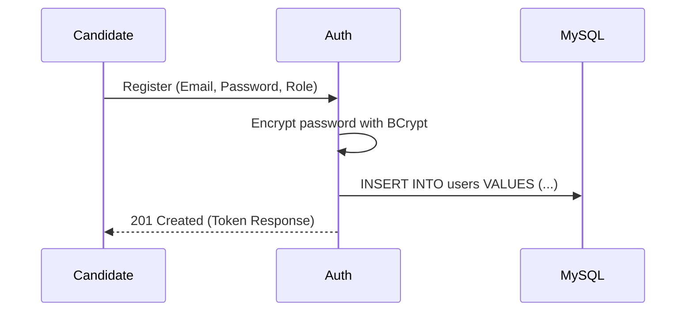

---

### 4. Profile Service
*   **Purpose**: Manages detailed structural profiles for both candidates and recruiters.
*   **Responsibilities**:
    *   Maintains comprehensive personal and professional data structures.
    *   Supports dynamic photo and resume file-path linking.
    *   Implements on-the-fly DTO mapping separating presentation layer from entities.
*   **APIs Handled**:
    *   `POST /profiles/candidate` (Initialize/Update candidate details)
    *   `POST /profiles/recruiter` (Initialize/Update recruiter details)
    *   `GET /profiles/candidate/{userId}` (Fetch specific candidate record)
    *   `GET /profiles/recruiter/{userId}` (Fetch specific recruiter record)
*   **Database Tables**: `candidate_profiles`, `recruiter_profiles`.
*   **Downstream Communications**: Connects back to `auth-service` via internal `AuthClient` to validate inter-service tokens.
*   **Tech Stack**: Java 21, Spring Boot, Spring Security, Spring Data JPA, Lombok, MySQL 8.
*   **Security Implementation**:
    *   Integrates `BearerAuthFilter` running on every request, verifying the local JWT against the remote Auth Validation endpoint.
    *   Enforces custom endpoint protection matching user identity to profile owner id.
*   **Internal Flow**:
    1. Filter validates JWT.
    2. Controller extracts client parameters.
    3. Service checks if profile exists for `userId`.
    4. If exists, performs a granular update, modifying nested structures (like dynamic address embeddables or list arrays). If not, creates new profile record.

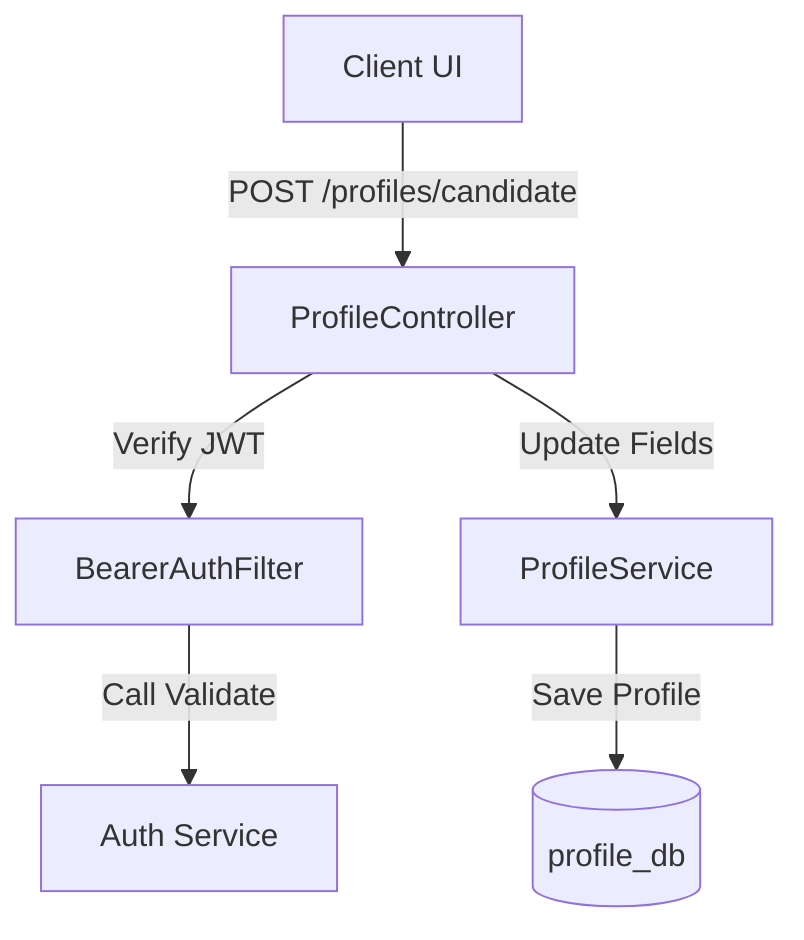

---

### 5. Job Service
*   **Purpose**: Manages job listings, elastic search parameters, and recruiter budget enforcement.
*   **Responsibilities**:
    *   Handles posting, updating, and removal of job openings.
    *   Provides multi-parameter query filtering (fuzzy search on title, location, salary range, recruiter id).
    *   Validates job-posting allowance by integrating with subscription limits.
    *   Allows bookmarks of jobs for rapid candidate tracking.
*   **APIs Handled**:
    *   `POST /jobs` (Create job - restricted by active subscription tier)
    *   `GET /jobs` (List all jobs - public)
    *   `GET /jobs/{id}` (Fetch specific job - public)
    *   `GET /jobs/search` (Search jobs by parameters - public)
    *   `POST /jobs/bookmarks` (Create bookmark)
    *   `GET /jobs/bookmarks/user/{userId}` (Fetch user bookmarks)
*   **Database Tables**: `jobs`, `job_bookmarks`.
*   **Downstream Communications**: Invokes `subscription-service` via `SubscriptionClient` to fetch active plan thresholds for the posting recruiter.
*   **Tech Stack**: Java 21, Spring Boot, Spring Data JPA (Specification API), Lombok, MySQL 8.
*   **Security Implementation**: Uses `BearerAuthFilter` to restrict writing/deleting endpoints to recruiters and administrators while allowing public reads.
*   **Internal Flow**:
    1. Recruiter requests to post a job.
    2. `JobService` invokes `SubscriptionClient` using a standard `RestClient` mapping.
    3. Fetches subscription plan: `FREE` (10 limit), `MONTHLY_99` (20 limit), `MONTHLY_199` (50 limit).
    4. Checks database: `repo.countByPostedByAndPostedAtAfter(recruiterId, startOfMonth)`.
    5. If count exceeds allowed tier limits, aborts transaction throwing `IllegalArgumentException("your free trail is over you have to but a plan")`.
    6. If allowed, persists new `Job` entity.

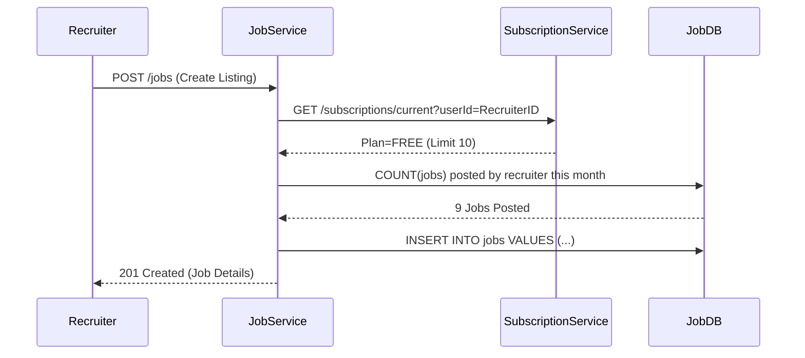

---

### 6. Application Service
*   **Purpose**: Operates as the core Application Tracking System (ATS).
*   **Responsibilities**:
    *   Orchestrates application submissions, attaching resumes and cover letters.
    *   Tracks structural application states (Applied, Shortlisted, Interviewing, Hired, Rejected).
    *   Maintains a chronological status history log string.
*   **APIs Handled**:
    *   `POST /applications` (Candidate applies for job)
    *   `GET /applications` (Admin list)
    *   `GET /applications/{id}` (Fetch single application)
    *   `PUT /applications/{id}/status` (Update applicant status - Recruiter only)
    *   `GET /applications/candidate/{candidateId}` (Fetch applications by candidate)
    *   `GET /applications/job/{jobId}` (Fetch applicants by job opening)
*   **Database Tables**: `applications`.
*   **Downstream Communications**: 
    *   Calls `job-service` to check job validity.
    *   Calls `profile-service` to assert candidate resume pathways.
*   **Tech Stack**: Java 21, Spring Boot, Spring Data JPA, Lombok, MySQL 8.
*   **Security Implementation**: Ensures candidates can only read their own applications; limits status updates strictly to the recruiter who posted the parent job opening.
*   **Internal Flow**:
    1. Validation of application parameters.
    2. Checks if candidate profile exists and copies default resume.
    3. Saves `Application` in `applications` table.
    4. State transition: When state changes (e.g., to `SHORTLISTED`), updates `statusHistory` (e.g. `[APPLIED -> SHORTLISTED at Instant.now()]`).

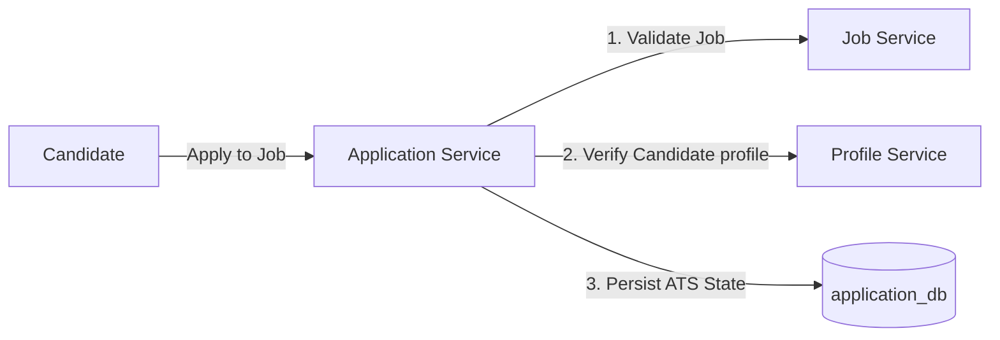

---

### 7. Interview Service
*   **Purpose**: Manages coordinate planning, schedules, and interview rooms.
*   **Responsibilities**:
    *   Allows recruiters to schedule online (Google Meet, Zoom) or in-person interviews.
    *   Supports reschedule requests and cancellation options.
    *   Dispatches microservice events asynchronously to decoupled platforms.
*   **APIs Handled**:
    *   `POST /interviews` (Schedule interview)
    *   `PUT /interviews/{id}/confirm` (Candidate confirms availability)
    *   `PUT /interviews/{id}/reschedule` (Reschedule slot)
    *   `GET /interviews/application/{appId}` (Fetch slot details)
*   **Database Tables**: `interviews`.
*   **Downstream Communications**:
    *   REST clients call `application-service`, `job-service`, and `profile-service` to compile details for notification builders.
    *   Publishes message to RabbitMQ exchange (`interview.exchange`).
*   **Tech Stack**: Java 21, Spring Boot, Spring Data JPA, RabbitTemplate, Lombok, MySQL 8.
*   **Security Implementation**: Validates candidate matches for confirmations; limits interview creation to recruiter accounts.
*   **Internal Flow**:
    1. Recruiter schedules interview details.
    2. Interview is saved in `interview_db` with `SCHEDULED` status.
    3. A nested thread builds metadata: gathers Candidate Name (from `profile-service`), Job Title & Company (from `job-service` through `application-service`).
    4. Packs metadata into a JSON object `InterviewEvent`.
    5. Publishes event using `RabbitTemplate.convertAndSend(EXCHANGE, "interview.scheduled", event)`.

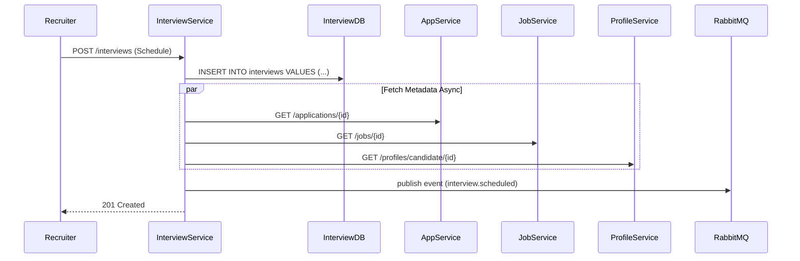

---

### 8. Notification Service
*   **Purpose**: Houses the unified communications alert mesh.
*   **Responsibilities**:
    *   Consumes async events from RabbitMQ and formats human-readable messages.
    *   Saves notifications historically in database.
    *   Performs real-time WebSocket pushes using STOMP.
*   **APIs Handled**:
    *   `GET /notifications/user/{userId}` (Retrieve notification inbox)
    *   `PUT /notifications/{id}/read` (Mark specific notification as read)
    *   WS endpoint: `/ws-notifications` (WebSocket handshake pathway)
*   **Database Tables**: `notifications`.
*   **Downstream Communications**: None. Serves as consumer.
*   **Tech Stack**: Java 21, Spring Boot, Spring AMQP (RabbitListener), Spring WebSocket Message Broker, MySQL 8.
*   **Security Implementation**: Websocket handshakes pass JWT token headers within connection arguments, matching browser identity to the user channel.
*   **Internal Flow**:
    1. `@RabbitListener` consumes `InterviewEvent` from `notification.queue`.
    2. Builds new `Notification` entity, prints debug alert simulated email log.
    3. Saves record into MySQL `notification_db`.
    4. Invokes `messagingTemplate.convertAndSend("/topic/notifications/" + userId, response)`.
    5. Client WebSocket listener captures payload and renders dynamic visual toaster.

```mermaid
graph TD
    Rabbit[RabbitMQ QUEUE: notification.queue] -->|1. Consume Event| Consumer[EventConsumer]
    Consumer -->|2. Save DB| Repo[NotificationRepository]
    Consumer -->|3. WS Push| Simp[SimpMessagingTemplate]
    Simp -->|4. Push to /topic/notifications/{userId}| Browser[Candidate UI Browser]
```

---

### 9. Subscription Service
*   **Purpose**: Manages monetization, subscriptions, plans, and invoices.
*   **Responsibilities**:
    *   Orchestrates Razorpay order generation dynamically.
    *   Verifies payment signatures using cryptographically safe HMAC hashing.
    *   Manages user plan limits (FREE, MONTHLY_99, MONTHLY_199).
    *   Generates systematic transactional records (Invoices).
*   **APIs Handled**:
    *   `POST /subscriptions/razorpay-order` (Initialize payment)
    *   `POST /subscriptions` (Complete subscription transaction and verify payment)
    *   `GET /subscriptions/current` (Retrieve active plan)
    *   `GET /invoices/admin/all` (Fetch invoices - Admin only)
*   **Database Tables**: `subscriptions`, `invoices`.
*   **Downstream Communications**: Bounded validation calls from `auth-service`.
*   **Tech Stack**: Java 21, Spring Boot, Spring Data JPA, Razorpay SDK, javax.crypto HMAC-SHA256, MySQL 8.
*   **Security Implementation**: High security payment validation. Re-computes signature using local secret key matching standard Razorpay specifications.
*   **Internal Flow**:
    1. Recruiter requests upgrade. Service invokes Razorpay SDK to create an official payment order in INR paises (cents).
    2. Razorpay returns order ID. Recruiter completes transaction inside UI checkout.
    3. Checkout returns payment ID and cryptographic signature.
    4. Service performs signature check: computes `orderId + "|" + paymentId` hashed with HMAC-SHA256 using key secret.
    5. On signature match, updates plan type to active, saves record, and prints Invoice.

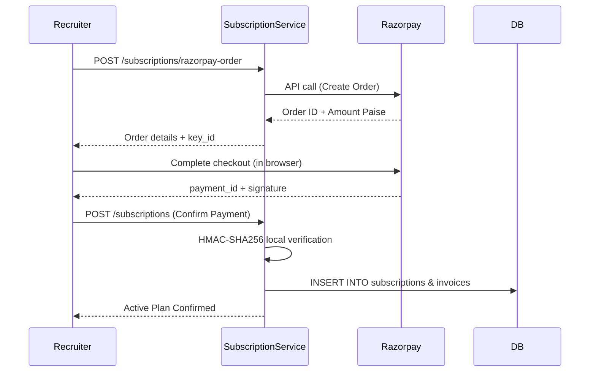

---

### 10. Analytics Service
*   **Purpose**: Serves as the central aggregation and platform monitoring engine.
*   **Responsibilities**:
    *   Aggregates data on-the-fly across separate databases using high-speed REST queries.
    *   Provides recruiter analytics covering applicant pipelines.
    *   Provides admin analytics covering revenue metrics, conversions, user growth, and live service status registry checks.
*   **APIs Handled**:
    *   `GET /analytics/recruiter/{recruiterId}`
    *   `GET /analytics/admin`
    *   `GET /analytics/health` (Checks Eureka registered instances against actual ports to render status dashboard)
*   **Database Tables**: Read-only aggregator (no persistent database tables).
*   **Downstream Communications**: Aggregates REST responses from `auth-service`, `job-service`, `application-service`, `subscription-service`, and `eureka-server`.
*   **Tech Stack**: Java 21, Spring Boot, Spring RestClient, Lombok.
*   **Security Implementation**: Enforces strict Admin-role verification checks for structural analytics APIs.
*   **Internal Flow**:
    1. Client triggers Admin dashboard.
    2. `AnalyticsService` fires parallel calls using RestClient:
       *   `/jobs` (Total active listings)
       *   `/applications` (Total candidates applying)
       *   `/invoices/admin/all` (Loops pricing to fetch gross revenue sum)
       *   `/auth/users` (Loops credentials to compile user roles)
    3. Calculates metric changes between the current 7-day bracket and the previous 7-day bracket.
    4. Aggregates conversion indicators (Applications -> Hired rates).
    5. Returns unified analytics DTO.

```mermaid
graph TD
    Client[Admin Dashboard] -->|GET /analytics/admin| Analytics[Analytics Service]
    par Aggregate Data
        Analytics -->|GET /auth/users| Auth[Auth Service]
        Analytics -->|GET /jobs| Job[Job Service]
        Analytics -->|GET /applications| App[Application Service]
        Analytics -->|GET /invoices/admin/all| Sub[Subscription Service]
    end
    Analytics -->|Compute Statistics & Growth| Analytics
    Analytics -->>Client: Return AdminAnalyticsResponse DTO
```

---

## 4. DATABASE DESIGN

HireConnect implements a highly resilient database design, dedicating an isolated schema to each microservice to prevent multi-service database joins and ensure database level independence.

### 📊 Entity-Relationship (ER) Diagram
Below is the microservice database schema representation, showing logical relations mapped by IDs:

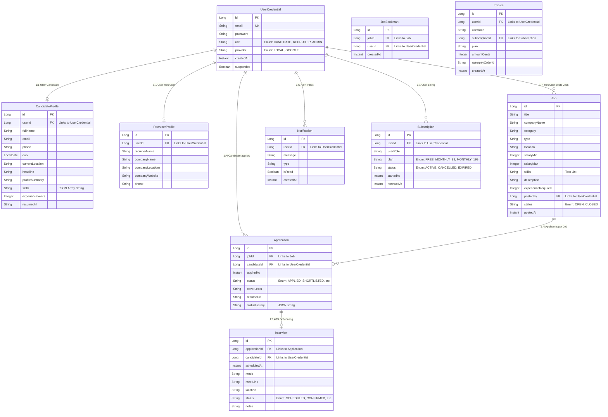

---

### 🔑 Schema Explanations & Table Constraints

#### 1. Database: `auth_db` | Table: `users`
*   **id**: `BIGINT AUTO_INCREMENT PRIMARY KEY`. Internal identifier.
*   **email**: `VARCHAR(255) NOT NULL UNIQUE`. Used as the primary login credential.
*   **password**: `VARCHAR(255)`. BCrypt-encoded hash (null for OAuth2 users).
*   **role**: `VARCHAR(50) NOT NULL`. Role constraint: `CANDIDATE`, `RECRUITER`, `ADMIN`.
*   **provider**: `VARCHAR(50) NOT NULL`. Verification route: `LOCAL` or `GOOGLE`.
*   **created_at**: `TIMESTAMP NOT NULL`. Account initialization timestamp.
*   **suspended**: `BIT(1) DEFAULT 0 NOT NULL`. Restricts login access when true.

#### 2. Database: `profile_db` | Table: `candidate_profiles`
*   **id**: `BIGINT AUTO_INCREMENT PRIMARY KEY`.
*   **user_id**: `BIGINT NOT NULL UNIQUE`. Linked logically to `users.id`.
*   **full_name**: `VARCHAR(120) NOT NULL`.
*   **email**: `VARCHAR(255)`. Contact fallback.
*   **skills**: `LONGTEXT` / `LOB`. Parsed JSON string containing array arrays.
*   **experience_years**: `INT`. Experience count for ATS matchmaking.
*   **resume_url**: `VARCHAR(500)`. Hyperlink pointing to local static upload server file.
*   **INDEX**: `idx_candidate_profiles_user_id (user_id)` marked UNIQUE to optimize profile reads.

#### 3. Database: `job_db` | Table: `jobs`
*   **id**: `BIGINT AUTO_INCREMENT PRIMARY KEY`.
*   **title**: `VARCHAR(140) NOT NULL`.
*   **posted_by**: `BIGINT NOT NULL`. Logically maps to Recruiter's user credential.
*   **status**: `VARCHAR(30) NOT NULL`. Opening state: `OPEN` or `CLOSED`.
*   **posted_at**: `TIMESTAMP NOT NULL`. Time of creation.
*   **INDEX**: `idx_jobs_title (title)`, `idx_jobs_location (location)`, `idx_jobs_posted_by (posted_by)`, `idx_jobs_status (status)`. Critical for high-speed dynamic search query filtering.

#### 4. Database: `application_db` | Table: `applications`
*   **id**: `BIGINT AUTO_INCREMENT PRIMARY KEY`.
*   **job_id**: `BIGINT NOT NULL`. Logically relates to Job.
*   **candidate_id**: `BIGINT NOT NULL`. Logically relates to Candidate User ID.
*   **status**: `VARCHAR(30) NOT NULL`. ATS State: `APPLIED`, `SHORTLISTED`, `INTERVIEWING`, `HIRED`, `REJECTED`.
*   **status_history**: `VARCHAR(1000)`. Raw history tracking transitions.
*   **INDEX**: `idx_applications_job_id (job_id)`, `idx_applications_candidate_id (candidate_id)`. Optimizes recruiter application pipelines and candidate submittal history reads.

#### 5. Database: `subscription_db` | Table: `subscriptions`
*   **id**: `BIGINT AUTO_INCREMENT PRIMARY KEY`.
*   **user_id**: `BIGINT NOT NULL UNIQUE`. Logically maps to paying user.
*   **plan**: `VARCHAR(50) NOT NULL`. Tier status: `FREE`, `MONTHLY_99`, `MONTHLY_199`.
*   **status**: `VARCHAR(50) NOT NULL`. Active state: `ACTIVE`, `CANCELLED`, `EXPIRED`.
*   **INDEX**: `idx_subscriptions_user_id (user_id)`. Ensures fast lookup during job posting limits validation.

---

### ⚙️ Database Architecture Principles

#### 🧼 Normalization Compliance
Each microservice database table is strictly designed in compliance with **Third Normal Form (3NF)**:
1. **First Normal Form (1NF)**: All column values are atomic (e.g. email, phone, location are single attributes).
2. **Second Normal Form (2NF)**: All non-key attributes are fully dependent on the primary key. Complex objects are separated into logical tables (e.g., separating Candidate Profile attributes from User Login Credentials).
3. **Third Normal Form (3NF)**: Transitive functional dependencies are eliminated. Non-key fields do not depend on other non-key fields. E.g., profile-service tables store `userId` but do not duplicate login details (email, encrypted password, provider).
4. **Decoupled Architecture Trade-off**: Denormalization is selectively applied for microservices decoupling. For instance, `Job` contains `companyName` as a direct column even though company info could technically be joined from `RecruiterProfile` in a monolithic DB. This avoids inter-database joins and network calls during heavy public job searches.

#### 🔍 Indexing Architecture
Custom indexes are systematically applied using JPA annotations:
*   **Fuzzy Search Optimization**: `idx_jobs_title` and `idx_jobs_location` allow MySQL to execute binary search lookups rather than performing expensive full-table scans when users query openings.
*   **Identity Lookup Optimization**: Unique indexes like `idx_candidate_profiles_user_id` reduce profile fetch times from $O(N)$ linear lookup down to $O(1)$ constant hash matching.

#### 📦 Database Engine Choice: Why MySQL?
*   **ACID Compliance**: Crucial for payment records (subscription service) and status transitions (ATS pipeline).
*   **Individual Relational Schemas**: Retains strong SQL structural consistency while letting databases scale horizontally or migrate to separate cloud storage independent of other schemas.

#### ⚡ Query Optimization & Transactions
*   **Dynamic JPA Specifications**: Used in `job-service` to build SQL predicates dynamically, matching user search filters without writing redundant queries.
*   **Connection Pooling**: Uses standard **HikariCP** pool configuration to maintain low-latency reusable database socket connections.
*   **Transaction Controls**: Enforced using `@Transactional` Spring AOP annotations:
    *   **Read-Only Transactions**: `@Transactional(readOnly = true)` disables Hibernate session dirty check dirty-checking, boosting performance on read-only endpoints.
    *   **Rollback Safeguards**: Automatically rolls back payment status changes or profile updates if downstream API calls fail midway, keeping data consistent.

---

## 5. AUTHENTICATION & SECURITY

HireConnect implements a highly secure, stateless authentication and authorization strategy.

### 🛡️ Core Security Architecture & Configuration

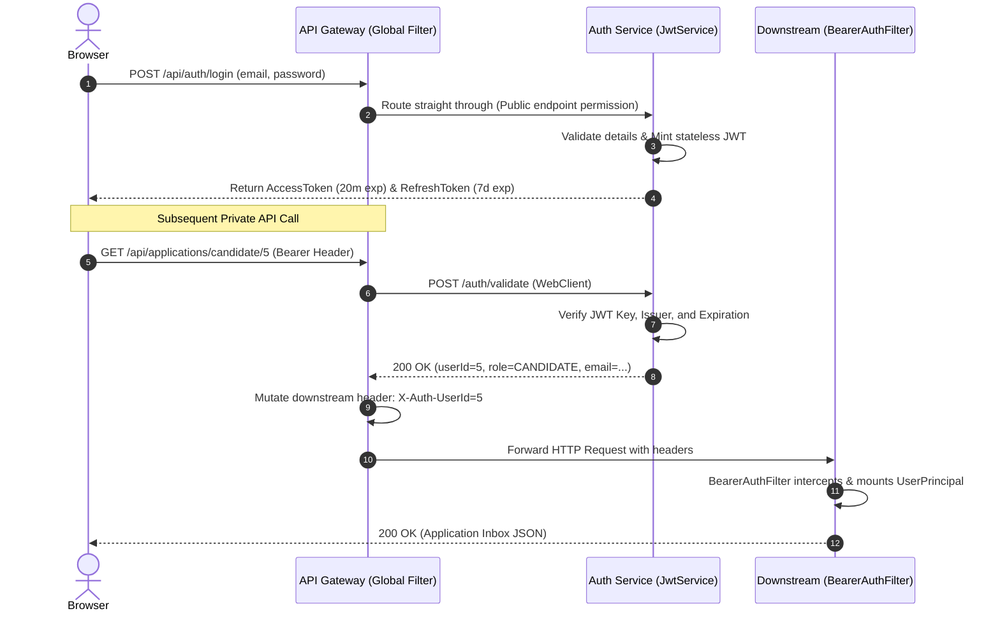

---

### 🔐 Detailed Security Protocols

#### 1. Stateless JWT Issuance & Cryptographic Signature
*   Authentication is anchored around stateless **JSON Web Tokens (JWT)**.
*   **Algorithm**: High-security symmetric signing using **HMAC-SHA256** (`HS256`).
*   **Key**: A strong base64-encoded secret key of at least 256 bits, loaded via application properties.
*   **Access Token Duration**: Expires in **20 minutes** for tight session security.
*   **Refresh Token Duration**: Expires in **7 days** to facilitate seamless session renewal without user re-authentication.
*   **Token Claims Structure**:
    ```json
    {
      "iss": "hireconnect",
      "sub": "user@email.com",
      "uid": 105,
      "email": "user@email.com",
      "role": "ROLE_CANDIDATE",
      "typ": "ACCESS",
      "iat": 1780000000,
      "exp": 1780001200
    }
    ```

#### 2. Standard Login/Register & Password Encryption
*   Traditional registrations leverage a **BCryptPasswordEncoder** configured inside `SecurityConfig.java`.
*   BCrypt incorporates a configurable **work factor (strength)** and utilizes a unique, randomized **salt** appended to each record prior to hashing, completely mitigating pre-computed rainbow table attacks.

#### 3. Inter-Service & Downstream Security Filters
*   **Double-Guard Architecture**: Security is verified at both the API Gateway and individual microservice levels:
    1.  **Gatekeeper Check (Gateway)**: The global gateway filter `JwtAuthGlobalFilter` intercepts every incoming request, validates the JWT, and rejects malformed calls immediately.
    2.  **Downstream Authentication (Microservices)**: Downstream services run their own `BearerAuthFilter` (extending `OncePerRequestFilter`). This filter intercepts requests, extracts the authorization token, and uses a Spring `RestClient` to call `auth-service`'s secure `/auth/validate` endpoint.
    3.  Once verified, the filter constructs a Spring `UserPrincipal` and injects it into the local thread's **SecurityContextHolder**, enabling method-level security validations (`@PreAuthorize("hasAuthority('ROLE_ADMIN')")`).

---

## 6. RABBITMQ IMPLEMENTATION

HireConnect integrates **RabbitMQ** to decouple long-running operations—specifically real-time notification dispatches—from core transactional services, ensuring system stability.

### 📬 Asynchronous Architecture Design
*   **Problem**: In a monolithic system, when a recruiter schedules an interview, the HTTP thread is blocked while generating calendars, building meeting rooms, and executing notification pipelines. If the email or notification server undergoes minor downtime, the entire interview scheduling flow crashes.
*   **Solution**: Decoupled async event handling via RabbitMQ:
    1.  `interview-service` schedules an interview in the database and immediately dispatches a lightweight JSON event to RabbitMQ.
    2.  The API request returns a `201 Created` status to the recruiter in milliseconds.
    3.  `notification-service` acts as an independent consumer, listening to the message queue and processing the notification pipeline in the background.

```mermaid
graph TD
    subgraph Interview Service (Producer)
        Sched[Recruiter schedules interview] -->|Persist Interview| DB_Int[(interview_db)]
        Sched -->|Build Event payload| Event[InterviewEvent DTO]
        Event -->|RabbitTemplate.convertAndSend| Exchange[Topic Exchange: interview.exchange]
    end

    subgraph RabbitMQ Broker
        Exchange -->|Routing Key: interview.scheduled| Queue[Queue: notification.queue]
    end

    subgraph Notification Service (Consumer)
        Queue -->|@RabbitListener| Consumer[EventConsumer]
        Consumer -->|Process & Format Message| Notif[Notification DTO]
        Notif -->|Persist Record| DB_Notif[(notification_db)]
        Notif -->|WebSocket SimpTemplate| Push[Push to Browser Topic]
    end
```

---

### ⚙️ RabbitMQ Structural Configurations & Message Lifecycle

*   **Exchange**: `interview.exchange` (Type: **Topic Exchange**). Topic exchanges allow flexible message routing based on dynamic wildcard patterns.
*   **Queue**: `notification.queue`. A durable queue configured to persist events even during broker restarts.
*   **Routing Key Pattern**: `interview.#`.
    *   The `#` wildcard matches zero or more dot-separated words.
    *   This routing key pattern binds `notification.queue` to receive all interview state transitions, such as:
        *   `interview.scheduled` (Scheduled)
        *   `interview.confirmed` (Confirmed)
        *   `interview.rescheduled` (Rescheduled)
*   **Message Conversion**: Decodes JSON payloads seamlessly using a configured `Jackson2JsonMessageConverter` bean.

---

### 📝 Step-by-Step Message Lifecycle Workflow

1.  **Recruiter Action**: Recruiter schedules an interview slot.
2.  **API Call**: Calls `POST /api/interviews`.
3.  **Local Persist**: `interview-service` commits the record to `interview_db`.
4.  **Async Build**: A background process fetches the candidate's name (from `profile-service`) and job title (from `job-service`) via RestClient.
5.  **Event Broadcast**: The service packages details into `InterviewEvent` and broadcasts it to RabbitMQ using the routing key `interview.scheduled`.
6.  **Broker Routing**: The broker's topic exchange `interview.exchange` receives the message, inspects the routing key `interview.scheduled`, matches it to the binding rule `interview.#`, and routes the event to `notification.queue`.
7.  **Consumer Pickup**: `@RabbitListener(queues = "notification.queue")` inside `notification-service` consumes the message instantly.
8.  **Format & Push**: The consumer maps details into a notification record, saves it to `notification_db`, and pushes it to the candidate's browser via WebSocket channel `/topic/notifications/{candidateId}`.

---

## 7. FRONTEND ARCHITECTURE

The frontend is a modern, responsive Single Page Application (SPA) built using **React 18** and **Vite**, styled with **Tailwind CSS**.

### 📁 Standardized Directory Layout
```text
frontend/
├── src/
│   ├── api/            # Centralized API endpoints grouped by feature
│   │   ├── auth.js     # Standard /auth calls
│   │   ├── jobs.js     # Job lookup and bookmarks
│   │   ├── profiles.js # Candidate & Recruiter profiles
│   │   └── ...
│   ├── components/     # Reusable UI Atoms and Molecules
│   │   ├── Layout.jsx  # Main container wrapping pages
│   │   ├── Navbar.jsx  # Context-aware global nav
│   │   └── ...
│   ├── context/        # Global React Context stores
│   │   └── NotificationContext.jsx # STOMP WebSocket mesh handler
│   ├── pages/          # Complete view modules (role-specialized)
│   │   ├── HomePage.jsx
│   │   ├── LoginPage.jsx
│   │   ├── CandidateProfilePage.jsx
│   │   └── ...
│   ├── App.css         # Styling tweaks
│   ├── App.jsx         # Component routing configurations
│   ├── index.css       # Tailwind base setup
│   └── main.jsx        # App mounting entry point
```

---

### 🗺️ Component Hierarchy Diagram
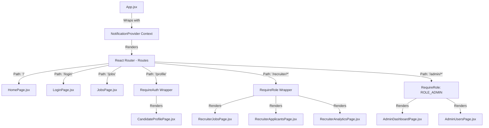

---

### 🚦 React Client Routing Flow
*   The application implements a custom **RequireAuth** and **RequireRole** wrapper to protect sensitive pages.
*   Upon login, the user's role is persisted in `localStorage` under key `hc_role`.
*   If an unauthenticated user attempts to access a protected route (e.g. `/profile`), the `RequireAuth` wrapper intercepts the transition and redirects them to `/login`.
*   If a candidate attempts to access a recruiter page (e.g. `/recruiter/jobs`), the `RequireRole` wrapper intercepts the route and redirects them back to the fallback page `/jobs`.

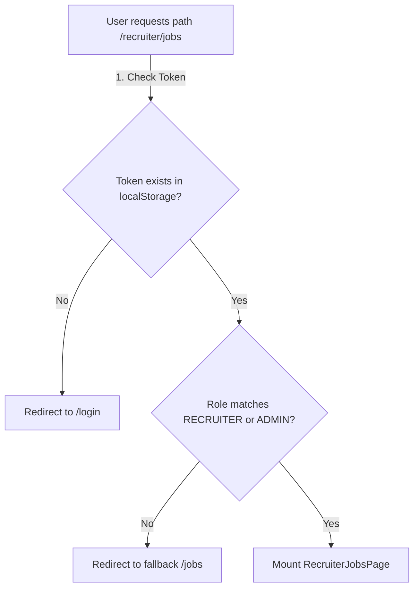

---

## 8. COMPLETE USER FLOW

Below are the end-to-end execution pathways for critical system operations:

---

### 1. User Registration & Login Flow

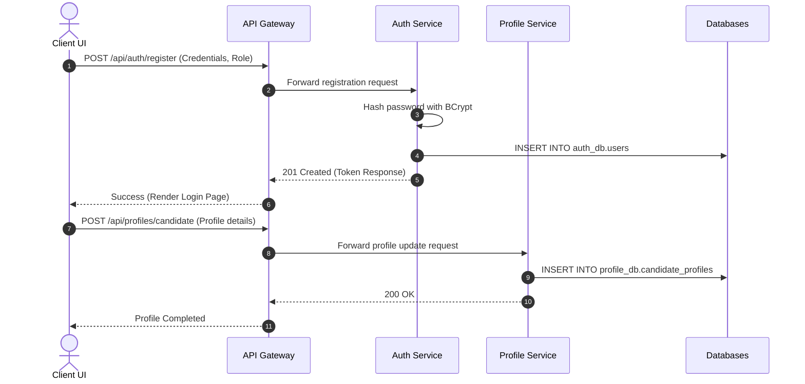

---

### 2. Recruiter Job Posting Limit Flow

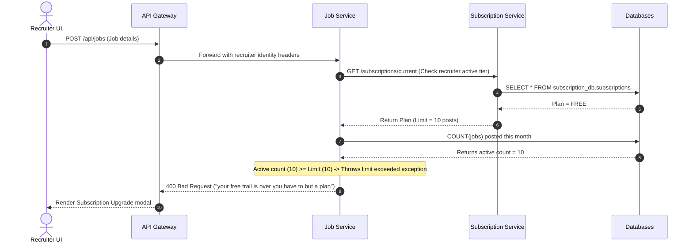

---

### 3. Interview Scheduling & WebSocket Notification Flow

```mermaid
sequenceDiagram
    autonumber
    actor Recruiter as Recruiter UI
    participant Gateway as API Gateway
    participant Int as Interview Service
    participant Rabbit as RabbitMQ
    participant Notif as Notification Service
    actor Candidate as Candidate UI

    Recruiter->>Gateway: POST /api/interviews (details, appId, candidateId)
    Gateway->>Int: Forward schedule request
    Int->>Int: Create Interview in interview_db
    Int->>Rabbit: Publish Event: interview.scheduled
    Int-->>Gateway: 201 Created (Success response to recruiter)
    Gateway-->>Recruiter: Render success toaster

    Note over Rabbit, Notif: Asynchronous Decoupled Phase
    Rabbit->>Notif: Deliver message via notification.queue
    Notif->>Notif: Save Alert in notification_db
    Notif->>Candidate: WS Push to /topic/notifications/{candidateId}
    Candidate->>Candidate: Render browser alert toaster dynamically
```

---

## 9. DEPLOYMENT ARCHITECTURE

HireConnect is designed to run in both localized development configurations and fully containerized environments using **Docker** and **Docker Compose**.

### 📦 Containerization Blueprint

#### 1. Multi-Stage Dockerfile Strategy
Each Java microservice utilizes a multi-stage Docker build to keep images extremely lightweight and secure:
*   **Build Stage**: Uses an official Maven JDK-21 image (`maven:3.9-eclipse-temurin-21`) to compile and package the application into a compact runner JAR.
*   **Run Stage**: Packages the compiled JAR into a lightweight, secure JRE image (`eclipse-temurin:21-jre-alpine`). This reduces the final container size by up to 60% and eliminates compilation-level security vulnerabilities.

#### 2. React Frontend Hosting
The React application is compiled using Vite's production bundler (`npm run build`). The static assets (HTML, CSS, JS) are hosted in an **Nginx Alpine** container, which acts as a high-performance web server and reverse proxies API requests seamlessly.

---

### 🌐 Docker Container Communication Flow

```mermaid
graph TD
    subgraph Host OS Environment
        Port_80[Public HTTP Port: 80]
        Port_8080[Gateway API Port: 8080]
        Port_8761[Eureka Dashboard Port: 8761]
    end

    subgraph Docker Bridge Network: hc-network
        Nginx[Frontend Container - Nginx]
        Gateway[API Gateway Container]
        Eureka[Eureka Registry Container]
        
        subgraph Decoupled Microservices
            Auth[Auth Service]
            Profile[Profile Service]
            Job[Job Service]
            App[Application Service]
            Int[Interview Service]
            Notif[Notification Service]
            Sub[Subscription Service]
            Analytics[Analytics Service]
        end
        
        Rabbit[RabbitMQ Container]
        Redis[Redis Container]
    end

    %% Mapping Host Ports
    Port_80 --- Nginx
    Port_8080 --- Gateway
    Port_8761 --- Eureka

    %% Internal routing
    Nginx -->|Proxy API calls| Gateway
    Gateway -->|Route queries| Eureka
    Gateway -->|Forward traffic| Decoupled Microservices
    
    %% Infrastructure access
    Auth -->|Cache| Redis
    Job -->|Cache| Redis
    Int -->|Publish| Rabbit
    Notif -->|Consume| Rabbit
```

---

### 🔒 Key Environment Configurations

The system externalizes all configurations, allowing seamless transitions between local development and containerized Docker environments:
*   `EUREKA_URL`: Maps to the Eureka discovery endpoint (`http://eureka-server:8761/eureka/` in Docker compose network, or `http://localhost:8761/eureka/` locally).
*   `DB_URL`: Dynamic JDBC connection string. In Docker, it leverages host network mapping (`jdbc:mysql://host.docker.internal:3306/`) to allow separate containers to access the host system's database.
*   `RABBITMQ_HOST`: Resolves to the dynamic virtual hostname `rabbitmq` within the Docker compose network bridge.

---

## 10. DESIGN PATTERNS & BEST PRACTICES

HireConnect implements modern enterprise software engineering patterns:

### 🧩 Core Design Patterns

#### 1. MVC (Model-View-Controller) Pattern
Decouples the system into three distinct layers:
*   **Model**: JPA Entities mapping standard database tables.
*   **View**: React presentation components displaying data.
*   **Controller**: Spring REST Controllers handling endpoints, mapping HTTP parameters, and return states.

#### 2. Repository Pattern
Leverages **Spring Data JPA** interfaces (`JpaRepository`). This pattern decouples data access logic from the business service layer, providing standard CRUD methods out-of-the-box and supporting dynamic queries via Spring Specifications.

#### 3. Service Layer Pattern
Encapsulates all core business logic inside `@Service` classes. This layer defines transaction boundaries, enforces access controls, orchestrates database interactions, and ensures high cohesiveness.

#### 4. DTO (Data Transfer Object) Pattern
Decouples the database schema from the API presentation layer:
*   Avoids exposing database entity structures directly to REST endpoints.
*   Prevents serialization issues (such as infinite circular loops in relational fields).
*   Allows the API payload to change without modifying underlying database tables.
*   DTO conversions are managed efficiently using **MapStruct** or standard builder mappings.

#### 5. Dependency Injection (Spring IoC)
*   Enforces clean dependency injection, favoring **Constructor Injection** over field-level injection (`@Autowired`) to ensure class testability.
*   Constructor generation is simplified using Lombok's `@RequiredArgsConstructor` annotation.

#### 6. Centralized Exception Handling
*   Avoids cluttering business services with redundant `try-catch` blocks.
*   Implements a global exception handling class annotated with `@RestControllerAdvice` in each microservice.
*   Catches standard exceptions (like `IllegalArgumentException` or `EntityNotFoundException`) and maps them to structured JSON error responses with precise HTTP status codes:
    ```json
    {
      "timestamp": "2026-05-17T03:20:00Z",
      "status": 400,
      "error": "Bad Request",
      "message": "your free trail is over you have to but a plan",
      "path": "/api/jobs"
    }
    ```

---

## 11. PERFORMANCE & SCALABILITY

HireConnect is built to easily scale under high concurrent user loads.

### 📈 Scalability Strengths
1.  **Independent Scaling Policies**: High-demand services (like `job-service` and `application-service`) can be spun up in multiple instances during heavy hiring seasons, while low-demand services (like `subscription-service`) remain at a single instance, optimizing resource utilization.
2.  **Asynchronous Message Buffering**: Using RabbitMQ protects internal systems during peak traffic spikes. If 10,000 interviews are scheduled simultaneously, the notification system will process notifications at its own pace without blocking or crashing the primary database transactions.
3.  **Read Optimization (Redis Caching)**: High-read operations—like searching active jobs or validating session tokens—are cached in Redis, reducing expensive database queries and dropping response times from milliseconds down to microseconds.

---

### 🔮 Future Scalability Roadmap
1.  **Orchestration via Kubernetes (K8s)**: Grouping Docker containers into functional pods. Implementing K8s horizontal pod autoscalers (HPA) to scale up containers dynamically based on real-time CPU and memory usage spikes.
2.  **Database Read-Write Splitting**: Scaling the MySQL database tier by introducing write primaries alongside multiple read replicas, directing heavy analytical read queries to replica databases.
3.  **API Gateway Rate Limiting**: Implementing token-bucket rate limiting at the API Gateway level (using Redis and Spring Cloud Gateway RateLimiter) to prevent API abuse, scraping bots, and DDoS attacks.

---

## 12. COMPLETE TECHNICAL SUMMARY

HireConnect is a highly performant, secure, and resilient job portal built on a modern **microservices architecture**.

### 🌟 High-Level Architectural Advantages
*   **High Fault Isolation**: If the subscription service or payment engine experiences downtime, users can still log in, search for jobs, apply, and schedule interviews without platform-wide interruption.
*   **Granular Technology Alignments**: Enables developers to scale each module independently or refactor individual services without impacting the rest of the codebase.
*   **Asynchronous Resilience**: The integration of RabbitMQ decouples transactional systems from notification pipelines, boosting performance and reliability.
*   **Robust Access Controls**: A stateless JWT architecture combined with role-based restrictions ensures strict endpoint protection across all services.

### 🏆 Key Business Challenges Solved
1.  **Recruiter Budget Enforcement**: Solved by implementing an active subscription verification filter within the job posting pipeline, restricting free accounts from exceeding post budgets.
2.  **Real-Time Status Tracking**: Solved by using WebSocket channels and SockJS to push application state updates and interview schedules directly to candidate browsers instantly.
3.  **Unified Analytics Aggregation**: Solved by using the `analytics-service` as a high-speed REST data aggregator, compiling metrics across separate databases without violating microservices data isolation.

This architectural blueprint showcases a robust, production-ready system designed to meet modern web standards, security protocols, and enterprise software engineering practices.
